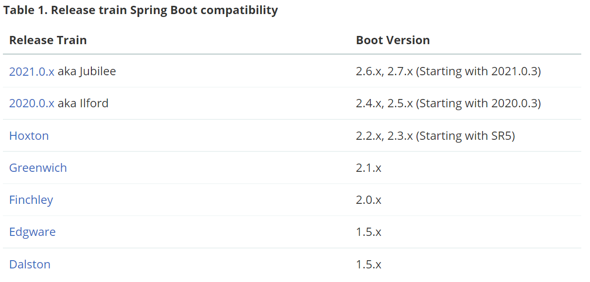
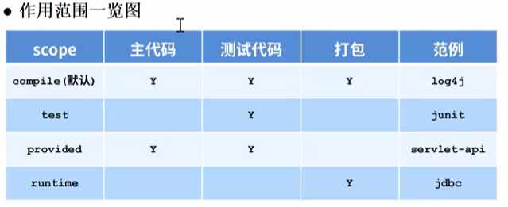

# SpringCloud

## 引出微服务

### 没有微服务技术，是不是程序员就不能开发大型项目？

可以开发，对大型项目进行模块划分，对各个模块进行实现，模块之间更多的是API调用完成，耦合度较高不利于扩展和维护

### 标准的微服务出现原因和价值是什么？

1.微服务可以根据业务不同，将一个大项目，分解成不同的服务（微服务，比如搜索服务/网关服务/配置服务/存储服务/发现服务等等）

2.各个服务通过分布式方式进行工作，从而可以高效，快速，稳定的完成复杂的功能

3.将原来大项目的某些模块 -> 抽出形成微服务 ->配合分布式工作方式->从而可以高效，快速，稳定的完成复杂的功能

### 提出问题/需求，引出微服务的必要性

搜狐-门户网站

1.在高并发时，解决服务熔断降级问题，保证系统的高可用性

2.在服务器集群时，要解决负载均衡问题

3.在复杂的网络情况下，要保证数据存储的稳定性和一致性

4.提供网关服务

### Spring社区-大旗一挥-整合优质组件

主要Netflix+Alibaba+自己开发

服务熔断降级模块/组件-Sentinel

服务发现和注册-Nacos

负载均衡组件-Ribbon

网关组件-Gateway

## 系统架构演变

单体架构

动静分离架构

分布式架构

微服务架构

详情查看---系统架构的演变过程__亿图

## 微服务

微服务是系统架构上的一种设计风格，它的主旨是将一个原本独立的系统拆分成多个小型服务，这些小型服务都在各自独立的进程中运行，服务之间通过基于HTTP的RESTful API进行通信合作

被拆分的每个小型服务都围绕着系统中的某一项或一些耦合度较高的业务进行构建，并且每个服务都维护者自身的数据存储，业务开发，自动化测试案例以及独立部署机制。由于有轻量级的通信协作基础，所以这些微服务可以使用不同的语言来编写。

## Spring Cloud全面说明（重要）

1.SpringCloud来源于Spring，是更高层次的，架构视角的综合性大型项目，目标旨在构建一套标准化的微服务解决方案，让架构师在使用微服务理念构建系统时，面向各环节的问题都可以找到相应的组件来处理。

2.SpringCloud是Spring社区为微服务架构提供的一个"全家桶"套餐。套餐中各个组件之间的配合，可以减少在组件的选型和整合上花费的精力，可以快速构建起基础的微服务架构系统，是微服务架构的最佳落地方案

3SpringCloud 天然支持SpringBoot（有版本对应要求），使用门槛较低

4.解决与分布式系统相关的复杂性-网络问题，延迟开销，带宽问题，安全问题

5处理服务发现的能力-服务发现允许集群中的进程和服务找到彼此并进行通信

6解决冗余问题-冗余问题经常发生在分布式系统中

7解决负载平衡-改进跨多个计算资源（例如计算机集群，网络链接，中央处理单元）的工作负载分布

## SpringCloud核心组件

消息驱动组件：Stream

声明式服务调用组件：OpenFeign

API网关：Gateway

Sleuth：分布式服务跟踪组件

Bus：消息总线组件

Config：分布式配置中心组件

### SpringCloud Alibaba

Sentinel：服务降级熔断

Nacos：服务注册&发现组件

Seata：分布式事务治理组件

Alibaba Cloud OSS：对象存储组件

其他...

### SpringCloud Netflix

Hystrix:服务熔断保护组件

zuul：网关治理组件

Eurka：治理组件

Ribbon：客户端负载均衡组件

其他...

## SpringCloud分布式示意图

The distributed nature of microservices brings challenges. Spring helps you mitigate these. With several ready-to-run cloud patterns, [Spring Cloud](https://spring.io/cloud) can help with service discovery, load-balancing, circuit-breaking, distributed tracing, and monitoring. It can even act as an API gateway.


SpringCloud是微服务的落地

SpringCloud体现了微服务的弹性设计

微服务的工作方式一般是基于分布式的

SpringCloud仍然是Spring家族一员，可以解决微服务的分布式工作方式带来的各种问题

SpringCloud提供很多组件，比如 服务发现，负载均衡，链路中断，分布式追踪和监控，甚至提供API Gateway功能

### SpringCloud和SpringBoot有版本对应关系

Adding Spring Cloud To An Existing Spring Boot Application

If you an existing Spring Boot app you want to add Spring Cloud to that app, the first step is to determine the version of Spring Cloud you should use. The version you use in your app will depend on the version of Spring Boot you are using.

The table below outlines which version of Spring Cloud maps to which version of Spring Boot.



Spring Cloud Dalston, Edgware, Finchley, and Greenwich have all reached end of life status and are no longer supported.

## SpringCloud组件选型

服务注册中心：Erueka:confused: ,Nacos:kissing_closed_eyes:,Zookeeper:kissing_closed_eyes:,Consul:kissing_closed_eyes:

服务负载均衡：Ribbon:kissing_closed_eyes:，LoadBalancer:kissing_closed_eyes:

服务熔断降级：Hystrix:confused:，Sentinel:kissing_closed_eyes:

服务调用：Feign:confused:，Open Feign:kissing_closed_eyes:

服务网关：Zuul:confused:，GateWay:kissing_closed_eyes:

服务配置：Config:confused:，Nacos:kissing_closed_eyes:

服务总线：Bus:confused:，Nacos:kissing_closed_eyes:

### 总结

#### SpringCloud原生组件的几大痛点

1.SpringCloud部分组件停止维护和更新，给开发带来不便

2.SpringCloud部分环境搭建复杂，没有完善的可视化界面，我们需要大量的二次开发和定制

3.SpringCloud配置复杂，难以上手

#### SpringCloudAlibaba的优势

1.阿里使用过的组件经历了考验【高并发，高性能，高可用】，性能强悍，设计合理，现在开源出来供大家使用。

2.搭配完善的可视化界面给开发运维带来极大的便利搭建简单。

#### 分布式微服务技术选型建议

1.SpringCloudAlibaba组件为主

2.SpringCloud为辅，比如（SpringCloud-Ribbon：负载均衡，SpringCloud-OpenFeign：调用远程服务，SpringCloud-Gateway：API网关，SpringCloud-Sleuth：调用链监控等）还是不错的。

## 配置父项目pom.xml

```xml-dtd
<project xmlns="http://maven.apache.org/POM/4.0.0" xmlns:xsi="http://www.w3.org/2001/XMLSchema-instance"
  xsi:schemaLocation="http://maven.apache.org/POM/4.0.0 http://maven.apache.org/maven-v4_0_0.xsd">
  <modelVersion>4.0.0</modelVersion>
  <groupId>org.jyx.springcloud</groupId>
  <artifactId>e-commerce-center</artifactId>
<!--  表明是一个父工程,聚合管理其他模块-->
  <packaging>pom</packaging>
  <version>1.0-SNAPSHOT</version>
  <name>e-commerce-center</name>
  <url>http://www.apache.org</url>
  <properties>
    <project.build.sourceEncoding>UTF-8</project.build.sourceEncoding>
    <maven.compiler.source>1.8</maven.compiler.source>
    <maven.compiler.target>1.8</maven.compiler.target>
    <junit.version>4.12</junit.version>
    <log4j.version>2.17.2</log4j.version>
    <mysql.version>5.1.47</mysql.version>
    <druid.version>1.1.17</druid.version>
    <mybatis.spring.boot.version>2.2.0</mybatis.spring.boot.version>
    <lombok.version>1.18.20</lombok.version>
  </properties>
  <dependencyManagement>
    <dependencies>
<!--      配置spring boot-->
      <dependency>
        <groupId>org.springframework.boot</groupId>
        <artifactId>spring-boot-dependencies</artifactId>
        <version>2.2.2.RELEASE</version>
<!--        1.type:pom 和scope:import 配合使用
            2.表示父项目的子模块，在引入springboot相关依赖时，锁定版本为2.2.2.RELEASE
            3.通过pom + import 解决maven单继承机制-->
        <type>pom</type>
        <scope>import</scope>
      </dependency>
<!--      配置spring cloud-->
      <dependency>
        <groupId>org.springframework.cloud</groupId>
        <artifactId>spring-cloud-dependencies</artifactId>
        <version>Hoxton.SR1</version>
        <type>pom</type>
        <scope>import</scope>
      </dependency>
      <!--      配置cloud alibaba-->
      <dependency>
        <groupId>com.alibaba.cloud</groupId>
        <artifactId>spring-cloud-alibaba-dependencies</artifactId>
        <version>2.1.0.RELEASE</version>
        <type>pom</type>
        <scope>import</scope>
      </dependency>
<!--      配置mysql-->
      <dependency>
        <groupId>mysql</groupId>
        <artifactId>mysql-connector-java</artifactId>
        <version>${mysql.version}</version>
      </dependency>
      <!--      配置druid数据源-->
      <dependency>
        <groupId>com.alibab</groupId>
        <artifactId>druid</artifactId>
        <version>${druid.version}</version>
      </dependency>
<!--      配置springboot整合mybatis starter-->
      <dependency>
        <groupId>org.mybatis.spring.boot</groupId>
        <artifactId>mybatis-spring-boot-starter</artifactId>
        <version>${mybatis.spring.boot.version}</version>
      </dependency>
      <!--      配置log4j，使用的最新高版本-->
      <dependency>
        <groupId>org.apache.logging.log4j</groupId>
        <artifactId>log4j</artifactId>
        <version>${log4j.version}</version>
      </dependency>
      <dependency>
        <groupId>junit</groupId>
        <artifactId>junit</artifactId>
        <version>${junit.version}</version>
      </dependency>
      <dependency>
        <groupId>org.projectlombok</groupId>
        <artifactId>lombok</artifactId>
        <version>${lombok.version}</version>
      </dependency>
    </dependencies>
  </dependencyManagement>
  <build>
    <finalName>e-commerce-center</finalName>
  </build>
</project>
```

### DependecyManagement细节说明

1、Maven使用dependecyManagement元素来提供了一种管理依赖版本号的方式。通常在项目packaging为POM，中使用dependencyManagement元素

2、使用pom.xml中的dependecyManagement元素能让所在在子项目中引用一个依赖，Maven会沿着父子层次向上走，直到找到一个拥有dependecyManagement元素的项目，然后它就会使用这个dependecyManagement元素中指定的版本号

3、好处：如果多个子项目都引用同一样依赖，则可以避免在每个使用的子项目都声明一个版本号，当升级或切换到另一个版本时，只需要在顶层父容器里更新，而不需要分别在子项目中修改；另外如果某个子项目需要另外的一个版本，只需要声明version就可。

4、dependecyManagement里只是声明依赖，并不实现引入，因此子项目需要显示的声明需要用的依赖

5、如果不在子项目中声明依赖，是不会从父项目中继承下来的，只有在子项目中写了该依赖项，并且没有指定具体版本，才会从父项目中继承该项，并且version和scope都读取自父pom



6、如果子项目中指定了版本号，那么会使用子项目中指定的jar版本


