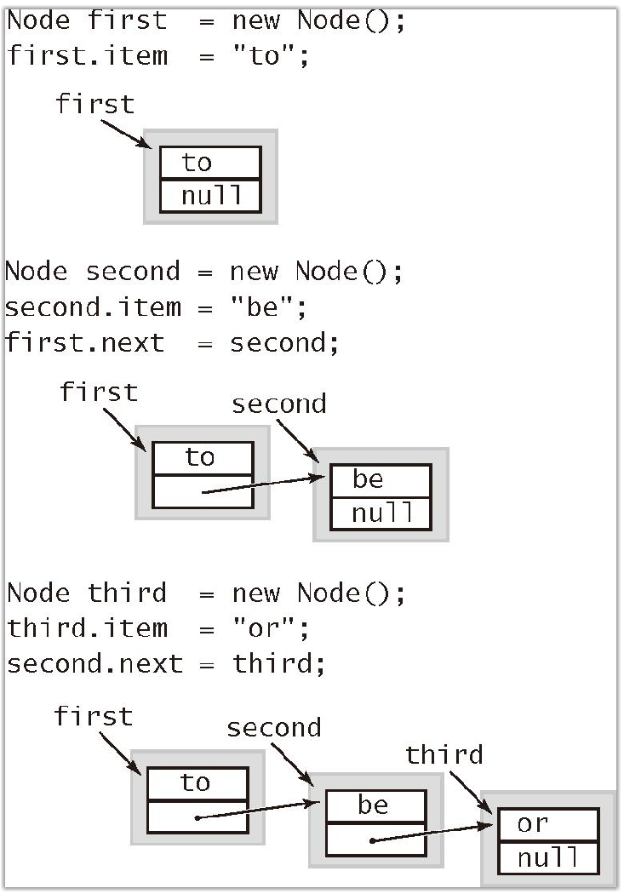
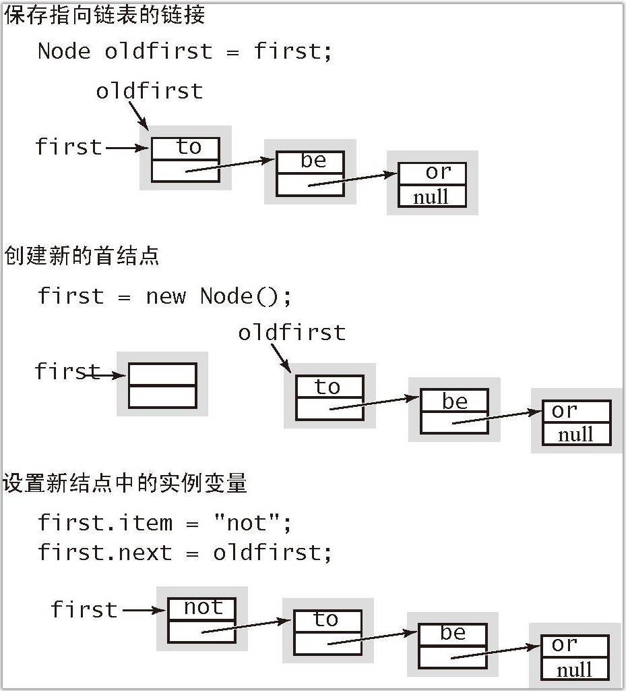
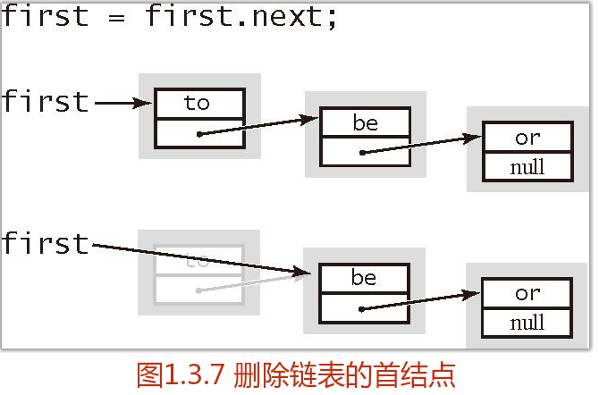
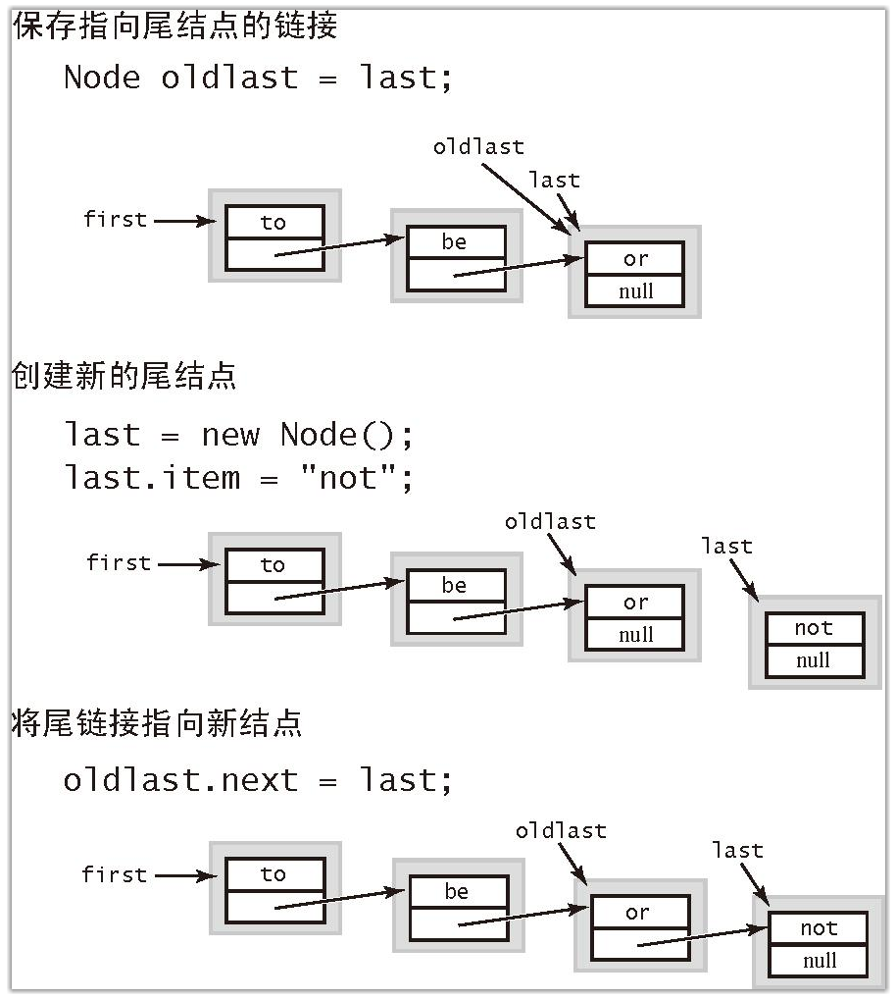
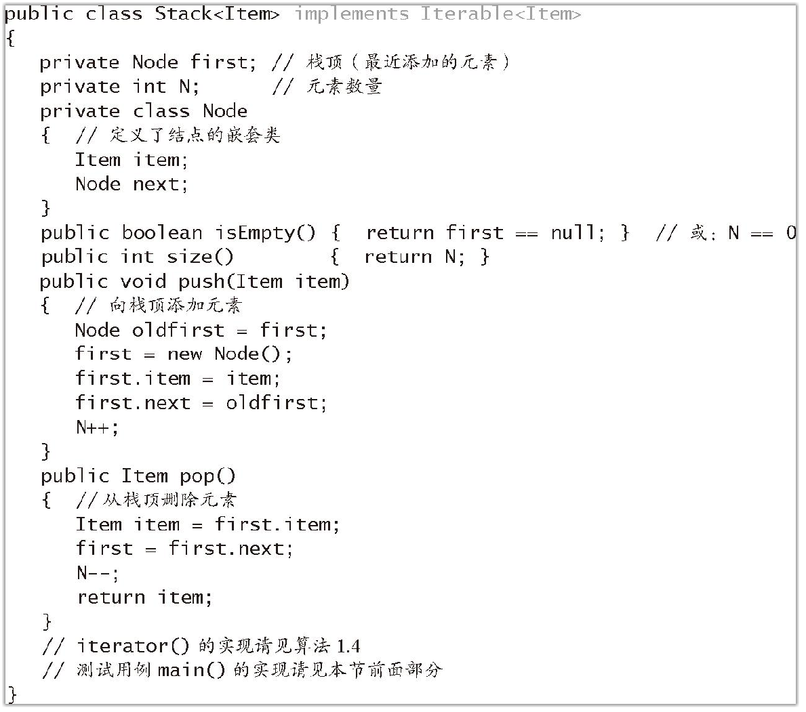
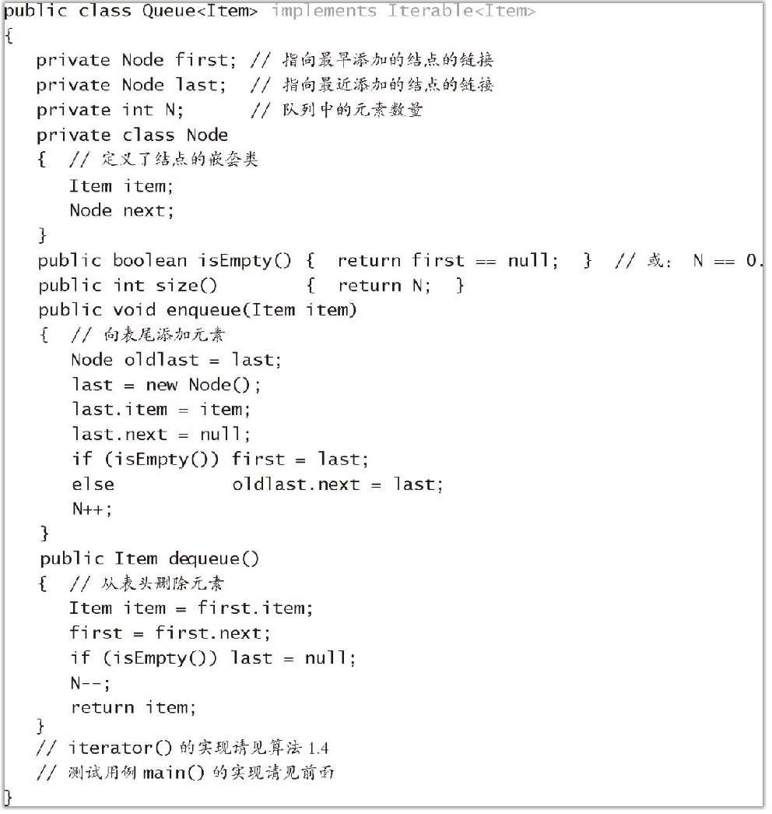

# 算法（第四版）

## 第一章基础

### 1.1基础编程模型

程序是对算法精确，优雅和完全的描述

可以通过运行程序来学习算法的各种性质

可以在应用程序中直接使用这些算法

把描述和实现算法所用到的语言特性，软件库和操作系统特性总称为基础编程模型

#### 1.1.1Java程序的基本结构

一段Java程序(类)或者是一个静态方法(函数)库，或者定义了一个数据类型。

定义静态方法库和定义数据类型，用到下面七种语法，Java语言的基础，大多数现代语言所共有的。

 原始数据类型：他们在计算机程序中精确地定义整数，浮点数和布尔值等。

 语句：语句通过创建变量并对其赋值，控制运行流程或者引发副作用来进行计算。我们会使用六种语句：声明、赋值、条件、循环、调用和返回。

数组：数组是多个同种数据类型的值的集合。

静态方法：静态方法可以封装并重用代码，使我们可以独立的模块开发程序。

字符串：字符串是一连串的字符，Java内置了它们的一些操作。

标准输入/输出：标准输入输出是程序和外界联系的桥梁

数据抽象：数据抽象封装和重用代码，使我们可以定义非原始数据类型，进而支持面向对面编程。

#### 1.1.2原始数据类型与表达式

数据类型就是一组数据和对其所能进行的操作的集合

整型，及其算术运算符（int）；

双精度实数类型，及其算术运算符（double）；

布尔型，它的值 {true, false} 及其逻辑操作（boolean）；

字符型，它的值是你能够输入的英文字母数字字符和符号（char）。

##### 1.1.2.1表达式

Java 使用的是中缀表达式：一个字面量（或是一个表达式），紧接着是一个运算符，再接着是另一个字面量（或者另一个表达式）

##### 1.1.2.2　类型转换

如果不会损失信息，数值会被自动提升为高级的数据类型

转换指的是在表达式中把类型名放在括号里将其后的值转换为括号中的类型。例如，(int)3.7 的值是 3 而 (double)3 的值是 3.0。需要注意的是将浮点型转换为整型将会截断小数部分而非四舍五入，在复杂的表达式中的类型转换可能会很复杂，应该小心并尽量少使用类型转换，最好是在表达式中只使用同一类型的字面量和变量。

##### 1.1.2.3　比较

结果是布尔型的表达式被称为布尔表达式

#### 1.1.3语句

Java 程序是由语句组成的

声明语句：创建某种类型的变量并用标识符为其命名。

赋值语句：将（由表达式产生的）某种类型的数值赋予一个变量。Java 还有一些隐式赋值的语法可以使某个变量的值相对于当前值发生变化，例如将一个整型值加 1。

条件语句：能够简单地改变执行流程——根据指定的条件执行两个代码段之一。

循环语句：更彻底地改变执行流程——只要条件为真就不断地反复执行代码段中的语句。

调用和返回语句：和静态方法有关（见 1.1.6 节），是改变执行流程和代码组织的另一种方式。

程序就是由一系列声明、赋值、条件、循环、调用和返回语句组成的。一般来说代码的结构都是嵌套的：一个条件语句或循环语句的代码段中也能包含条件语句或是循环语句。

##### 1.1.3.1　声明语句

声明语句将一个变量名和一个类型在编译时关联起来。

##### 1.1.3.2　赋值语句

赋值语句将（由一个表达式定义的）某个数据类型的值和一个变量关联起来。

##### 1.1.3.3　条件语句

大多数运算都需要用不同的操作来处理不同的输入。在 Java 中表达这种差异的一种方法是 if 语句：

```
if (<boolean expression>) { <block statements> }


```

这种描述方式是一种叫做模板的形式记法，我们偶尔会使用这种格式来表示 Java 的语法。

尖括号（<>）中的是我们已经定义过的语法，这表示我们可以在指定的位置使用该语法的任意实例。

##### 1.1.3.4　循环语句循环语句

许多运算都需要重复。Java 语言中处理这种计算的基本语句的格式是：

```
while (<boolean expression>) { <block statements> }
```

我们将循环语句中的代码段称为循环体。

##### 1.1.3.5　break 与 continue 语句

有些情况下我们也会需要比基本的 if 和 while 语句更加复杂的流程控制。相应地，Java 支持在while 循环中使用另外两条语句：

break 语句，立即从循环中退出；

continue 语句，立即开始下一轮循环。

#### 1.1.5 数组

数组能够顺序存储相同类型的多个数据。

##### 1.1.5.1　创建并初始化数组

在 Java 程序中创建一个数组需要三步：
·声明数组的名字和类型；
·创建数组；
·初始化数组元素。

在声明数组时，需要指定数组的名称和它含有的数据的类型。

#### 1.1.6静态方法

本书中的所有 Java 程序要么是数据类型的定义，要么是一个静态方法库

在许多语言中，静态方法被称为函数，因为它们和数学函数的性质类似

静态方法是一组在被调用时会被顺序执行的语句

##### 1.1.6.1　静态方法

方法封装了由一系列语句所描述的运算。方法需要参数（某种数据类型的值）并根据参数计算出某种数据类型的返回值（例如数学函数的结果）或者产生某种副作用

每个静态方法都是由签名（关键字public static 以及函数的返回值，方法名以及一串各种类型的参数）和函数体（即包含在花括号中的代码）组成的

##### 1.1.6.2　调用静态方法

调用静态方法的方法是写出方法名并在后面的括号中列出参数值，用逗号分隔。

##### 1.1.6.3　方法的性质

方法的参数按值传递：在方法中参数变量的使用方法和局部变量相同，唯一不同的是参数变量的初始值是由调用方提供的。方法处理的是参数的值，而非参数本身。这种方式产生的结果是在静态方法中改变一个参数变量的值对调用者没有影响。

方法名可以被重载：例如，Java 的 Math 包使用这种方法为所有的原始数值类型实现了 Math.abs()、Math.min() 和 Math.max() 函数。

方法只能返回一个值，但可以包含多个返回语句：Java 方法只能返回一个值，它的类型是方法签名中声明的类型。

方法可以产生副作用：方法的返回值可以是 void，这表示该方法没有返回值。返回值为 void 的静态函数不需要明确的返回语句，方法的最后一条语句执行完毕后控制权将会返回给调用方。我们称 void 类型的静态方法会产生副作用（接受输入、产生输出、修改数组或者改变系统状态）。

##### 1.1.6.4　递归

方法可以调用自己。

编写递归代码时最重要的有以下三点。

递归总有一个最简单的情况——方法的第一条语句总是一个包含return 的条件语句。

递归调用总是去尝试解决一个规模更小的子问题，这样递归才能收敛到最简单的情况。

递归调用的父问题和尝试解决的子问题之间不应该有交集。

##### 1.1.6.5　基础编程模型

静态方法库是定义在一个 Java 类中的一组静态方法。类的声明是public class 加上类名，以及用花括号包含的静态方法。

##### 1.1.6.6　模块化编程

这个模型的最重要之处在于通过静态方法库实现了模块化编程。我们可以构造许多个静态方法库（模块），一个库中的静态方法也能够调用另一个库中定义的静态方法。

程序整体的代码量很大时，每次处理的模块大小仍然适中；

可以共享和重用代码而无需重新实现；

很容易用改进的实现替换老的实现

可以为解决编程问题建立合适的抽象模型

缩小调试范围

#### 1.1.7 API

模块化编程的一个重要组成部分就是记录库方法的用法并供其他人参考的文档。我们会统一使用应用程序编程接口（API）的方式列出本书中使用的每个库方法名称、签名和简短的描述。我们用用例来指代调用另一个库中的方法的程序，用实现描述实现了某个 API 方法的 Java 代码。

API 的目的是将调用和实现分离

#### 1.1.8 字符串

字符串是由一串字符（char 类型的值）组成的。

##### 1.1.8.1　字符串拼接

和各种原始数据类型一样，Java 内置了一个串联String 类型字符串的运算符（+）。

##### 1.1.8.2　类型转换

字符串的两个主要用途分别是将用户从键盘输入的内容转换成相应数据类型的值以及将各种数据类型的值转化成能够在屏幕上显示的内容。

parseXXX（） toString

##### 1.1.8.3　自动转换

如果加号（+）的一个参数是字符串，那么 Java 会自动将其他参数都转换为字符串（如果它们不是的话）。

##### 1.1.8.4　命令行参数

在 Java 中字符串的一个重要的用途就是使程序能够接收到从命令行传递来的信息。

#### 1.1.9 输入输出

在我们的模型中，Java 程序可以从命令行参数或者一个名为标准输入流的抽象字符流中获得输入，并将输出写入另一个名为标准输出流的字符流中。

#### 1.1.10 二分查找

### 1.2数据抽象

数据类型指的是一组值和一组对这些值的操作的集合。

Java 编程的基础主要是使用 class 关键字构造被称为引用类型的数据类型。这种编程风格也称为面向对象编程，因为它的核心概念是对象，即保存了某个数据类型的值的实体。

抽象数据类型（ADT）是一种能够对使用者隐藏数据表示的数据类型。用 Java 类来实现抽象数据类型和用一组静态方法实现一个函数库并没有什么不同。抽象数据类型的主要不同之处在于它将数据和函数的实现关联，并将数据的表示方式隐藏起来。在使用抽象数据类型时，我们的注意力集中在 API 描述的操作上而不会去关心数据的表示；在实现抽象数据类型时，我们的注意力集中在数据本身并将实现对该数据的各种操作。

#### 1.2.1 使用抽象数据类型

##### 1.2.1.1　抽象数据类型的 API

我们使用应用程序编程接口（API）来说明抽象数据类型的行为。

##### 1.2.1.2　继承的方法

根据 Java 的约定，任意数据类型都能通过在 API 中包含特定的方法从 Java 的内在机制中获益。

##### 1.2.1.3　用例代码

和基于静态方法的模块化编程一样，API 允许我们在不知道实现细节的情况下编写调用它的代码（以及在不知道任何用例代码的情况下编写实现代码）。

在用例代码中，你需要声明变量、创建对象来保存数据类型的值并允许通过实例方法来操作它们。

##### 1.2.1.4　对象

对象是能够承载数据类型的值的实体。所有对象都有三大重要特性：状态、标识和行为。对象的状态即数据类型中的值。对象的标识能够将一个对象区别于另一个对象。可以认为对象的标识就是它在内存中的位置。对象的行为就是数据类型的操作。

##### 1.2.1.5　创建对象

每种数据类型中的值都存储于一个对象中。要创建（或实例化）一个对象，我们用关键字 new 并紧跟类名以及 ()（或在括号中指定一系列的参数，如果构造函数需要的话）来触发它的构造函数。构造函数没有返回值，因为它总是返回它的数据类型的对象的引用。每当用例调用了new()，系统都会：

·为新的对象分配内存空间；
·调用构造函数初始化对象中的值；
·返回该对象的一个引用。

##### 1.2.1.6　调用实例方法

实例方法的意义在于操作数据类型中的值，因此 Java 语言提供了一种特别的机制来触发实例方法，它突出了实例方法和对象之间的联系。

##### 1.2.1.7　使用对象

通过声明语句可以将变量名赋给对象，在代码中，我们不仅可以用该变量创建对象和调用实例方法，也可以像使用整数、浮点数和其他原始数据类型的变量一样使用它。

要开发某种给定数据类型的用例，我们需要：
·声明该类型的变量，以用来引用对象；
·使用关键字 new 触发能够创建该类型的对象的一个构造函数；                               ·使用变量名在语句或表达式中调用实例方法。 

##### 1.2.1.8　赋值语句

使用引用类型的赋值语句将会创建该引用的一个副本。赋值语句不会创建新的对象，而只是创建另一个指向某个已经存在的对象的引用。这种情况被称为别名：两个变量同时指向同一个对象。别名的效果可能会出乎你的意料，因为对于原始数据类型的变量，情况不同，你必须理解其中的差异。如果 x 和 y 是原始数据类型的变量，那么赋值语句x = y 会将 y 的值复制到 x 中。对于引用类型，复制的是引用（而非实际的值）。

##### 1.2.1.9　将对象作为参数

可以将对象作为参数传递给方法，这一般都能简化用例代码。

##### 1.2.1.10　将对象作为返回值

当然也能够将对象作为方法的返回值。

##### 1.2.1.11　数组也是对象

在 Java 中，所有非原始数据类型的值都是对象。也就是说，数组也是对象。和字符串一样，Java 语言对于数组的某些操作有特殊的支持：声明、初始化和索引。

##### 1.2.1.12　对象的数组

创建一个对象的数组需要以下两个步骤：
·使用方括号语法调用数组的构造函数创建数组；
·对于每个数组元素调用它的构造函数创建相应的对象。

总结：数据类型指的是一组值和一组对值的操作的集合。我们会将数据类型实现在独立的 Java 类模块中并编写它们的用例。对象是能够存储任意该数据类型的值的实体，或数据类型的实例。对象有三大关键性质：状态、标识和行为。一个数据类型的实现所支持的操作如下。
·创建对象（创造它的标识）：使用 new 关键字触发构造函数并创建对象，初始化对象中的值并返回对它的引用。
·操作对象中的值（控制对象的行为，可能会改变对象的状态）：使用和对象关联的变量调用实例方法来对对象中的值进行操作。
·操作多个对象：创建对象的数组，像原始数据类型的值一样将它们传递给方法或是从方法中返回，只是变量关联的是对象的引用而非对象本身。

### 1.3背包、队列和栈

许多基础数据类型都和对象的集合有关。

#### 1.3.1API

##### 1.3.1.1　泛型

集合类的抽象数据类型的一个关键特性是我们应该可以用它们存储任意类型的数据。。一种特别的Java 机制能够做到这一点，它被称为泛型，也叫做参数化类型。

##### 1.3.1.2　自动装箱

类型参数必须被实例化为引用类型，因此 Java 有一种特殊机制来使泛型代码能够处理原始数据类型。

##### 1.3.1.3　可迭代的集合类型

对于许多应用场景，用例的要求只是用某种方式处理集合中的每个元素，或者叫做迭代访问集合中的所有元素。

foreach 语句：可以将for 语句看做对于集合中的每个交易 t(foreach)，执行以下代码段。

##### 1.3.1.4　背包

背包是一种不支持从中删除元素的集合数据类型——它的目的就是帮助用例收集元素并迭代遍历所有收集到的元素（用例也可以检查背包是否为空或者获取背包中元素的数量）。

##### 1.3.1.5　先进先出队列

先进先出队列（或简称队列）是一种基于先进先出（FIFO）策略的集合类型

##### 1.3.1.6　下压栈

下压栈（或简称栈）是一种基于后进先出（LIFO）策略的集合类型

##### 1.3.1.7　算术表达式求值

```java
package chapter01;

import edu.princeton.cs.algs4.Stack;
import edu.princeton.cs.algs4.StdIn;
import edu.princeton.cs.algs4.StdOut;

public class Evaluate {
    public static void main(String[] args) {
        Stack<String> ops = new Stack<String>();
        Stack<Double> vals = new Stack<Double>();
        while (!StdIn.isEmpty()){
            String s = StdIn.readString();
            if(s.equals("("));
            else if(s.equals("+")) ops.push(s);
            else if(s.equals("-")) ops.push(s);
            else if(s.equals("*")) ops.push(s);
            else if(s.equals("/")) ops.push(s);
            else if(s.equals("sqrt")) ops.push(s);
            else if(s.equals(")")){
                String op= ops.pop();
                double v= vals.pop();
                if (op.equals("+")) v = vals.pop() + v;
                else if (op.equals("-")) v = vals.pop() - v;
                else if (op.equals("*")) v = vals.pop() * v;
                else if (op.equals("/")) v = vals.pop() / v;
                else if (op.equals("sqrt")) v = Math.sqrt(v);
                vals.push(v);
            }// 如果字符既非运算符也不是括号，将它作为double 值压入栈
            else if (s.equals("q")) break;
            else vals.push(Double.parseDouble(s));
        }
        StdOut.println(vals.pop());
        }
    }


```

#### 1.3.2 集合类数据类型的实现

##### 1.3.2.1　定容栈

容量固定

#### 1.3.3 链表

链表是一种递归的数据结构，它或者为空（null），或者是指向一个结点（node）的引用，该结点含有一个泛型的元素和一个指向另一条链表的引用。

在这个定义中，结点是一个可能含有任意类型数据的抽象实体，它所包含的指向结点的应用显示了它在构造链表之中的作用。

##### 1.3.3.1　结点记录

```java
private class Node
{
Item item;
Node next;
}
```

##### 1.3.3.2　构造链表

链表表示的是一列元素



##### 1.3.3.3　在表头插入结点



##### 1.3.3.4　从表头删除结点



##### 1.3.3.5　在表尾插入结点



##### 1.3.3.6　其他位置的插入和删除操作

实现任意插入和删除操作的标准解决方案是使用双向链表

##### 1.3.3.7　遍历

要访问一个数组中的所有元素，我们会使用如下代码来循环处理 a[] 中的所有元素：

```java
for (int i = 0; i < N; i++)
{
// 处理a[i]
}
```

访问链表中的所有元素也有一个对应的方式：将循环的索引变量 x 初始化为链表的首结点，然后通过 x.item 访问和 x 相关联的元素，并将 x 设为 x.next 来访问链表中的下一个结点，如此反复直到 x 为 null 为止（这说明我们已经到达了链表的结尾）。这个过程被称为链表的遍历，可以用以下循环处理链表的每个结点的代码简洁表达，其中 first 指向链表的首结点：

```
for (Node x = first; x！= null; x = x.next)
{
// 处理x.item
}
```

##### 1.3.3.8　栈的实现

算法 1.2　下压堆栈（链表实现）



##### 1.3.3.9　队列的实现

算法 1.3　先进先出队列



##### 1.3.3.10　背包的实现

算法 1.4　背包

```java
import java.util.Iterator;
public class Bag<Item> implements Iterable<Item>
{
    private Node first; // 链表的首结点
    private class Node
    {
        Item item;
        Node next;
    }
    public void add(Item item)
    { // 和Stack 的push() 方法完全相同
        Node oldfirst = first;
        first = new Node();
        first.item = item;
        first.next = oldfirst;
    }
    public Iterator<Item> iterator()
    { return new ListIterator(); }
    private class ListIterator implements Iterator<Item>
    {
        private Node current = first;
        public boolean hasNext()
        { return current！= null; }
        public void remove() { }
        public Item next()
        {
            Item item = current.item;
            current = current.next;
            return item;
        }
    }
}
```

### 1.5 案例研究：union-find 算法

#### 1.5.1 动态连通性

首先我们详细地说明一下问题：问题的输入是一列整数对，其中每个整数都表示一个某种类型的对象，一对整数 p q 可以被理解为“p 和 q 是相连的”。我们假设“相连”是一种等价关系，这也就意味着它具有：

自反性：p 和 p 是相连的；
·对称性：如果p 和q 是相连的，那么q 和p 也是相连的；
·传递性：如果 p 和 q 是相连的且 q 和 r 是相连的，那么 p 和 r 也是相连的。

等价关系能够将对象分为多个等价类。在这里，当且仅当两个对象相连时它们才属于同一个等价类。我们的目标是编写一个程序来过滤掉序列中所有无意义的整数对（两个整数均来自于同一个等价类中）。换句话说，当程序从输入中读取了整数对 p q 时，如果已知的所有整数对都不能说明 p 和 q 是相连的，那么则将这一对整数写入到输出中。如果已知的数据可以说明p 和 q 是相连的，那么程序应该忽略 p q 这对整数并继续处理输入中的下一对整数。图 1.5.1 用一个例子说明了这个过程。为了达到所期望的效果，我们需要设计一个数据结构来保存程序已知的所有整数对的足够多的信息，并用它们来判断一对新对象是否是相连的。我们将这个问题通俗地叫做动态连通性问题。这个问题可能有以下应用。

##### 1.5.1.1　网络

输入中的整数表示的可能是一个大型计算机网络中的计算机，而整数对则表示网络中的连接。这个程序能够判定我们是否需要在 p 和 q 之间架设一条新的连接才能进行通信，或是我们可以通过已有的连接在两者之间建立通信线路；或者这些整数表示的可能是电子电路中的触点，而整数对表示的是连接触点之间的电路；或者这些整数表示的可能是社交网络中的人，而整数对表示的是朋友关系。在此类应用中，我们可能需要处理数百万的对象和数十亿的连接。

##### 1.5.1.2　变量名等价性

某些编程环境允许声明两个等价的变量名（指向同一个对象的多个引用）。在一系列这样的声明之后，系统需要能够判别两个给定的变量名是否等价。这种较早出现的应用（如 FORTRAN 语言）推动了我们即将讨论的算法的发展。

##### 1.5.1.3　数学集合

在更高的抽象层次上，可以将输入的所有整数看做属于不同的数学集合。

算法 1.5　union-find 的实现

```java
public class UF
{
    private int[] id; // 分量id（以触点作为索引）
    private int count; // 分量数量
    public UF(int N)
    { // 初始化分量id数组
        count = N;
        id = new int[N];
        for (int i = 0; i < N; i++)
            id[i] = i;
    }
    public int count()
    { return count; }
    public boolean connected(int p, int q)
    { return find(p) == find(q); }
    public int find(int p)
        public void union(int p, int q)
        // 请见1.5.2.1节用例（quick-find）、1.5.2.3节用例（quick-union）和算法1.5（加权quick-union）
        public static void main(String[] args)
    { // 解决由StdIn得到的动态连通性问题
        int N = StdIn.readInt(); // 读取触点数量
        UF uf = new UF(N); // 初始化N个分量
        while (！StdIn.isEmpty())
        {
            int p = StdIn.readInt();
            int q = StdIn.readInt(); // 读取整数对
            if (uf.connected(p, q)) continue; // 如果已经连通则忽略
            uf.union(p, q); // 归并分量
            StdOut.println(p + " " + q); // 打印连接
        }
        StdOut.println(uf.count() + "components");
    }
    
}
```

#### 1.5.2 实现

##### 1.5.2.1　quick-find 算法

```java
public int find(int p)
{ return id[p]; }
public void union(int p, int q)
{ // 将p和q归并到相同的分量中
    int pID = find(p);
    int qID = find(q);
    // 如果p和q已经在相同的分量之中则不需要采取任何行动
    if (pID == qID) return;
    // 将p的分量重命名为q的名称
    for (int i = 0; i < id.length; i++)
        if (id[i] == pID) id[i] = qID;
    count——;
}
```

##### 1.5.2.3　quick-union 算法

```java
private int find(int p)
{ // 找出分量的名称
    while (p！= id[p]) p = id[p];
    return p;
}
public void union(int p, int q)
{ // 将p和q的根节点统一
    int pRoot = find(p);
    int qRoot = find(q);
    if (pRoot == qRoot) return;
    id[pRoot] = qRoot;
    count——;
}
```

## 第二章排序

### 2.1初级排序算法

#### 2.1.1游戏规则

排序算法类的模板

```java
public class Example
{
    public static void sort(Comparable[] a){ /* 请见算法2.1、算法2.2、算法2.3、算法2.4、算法2.5或算法2.7*/ }
    private static boolean less(Comparable v, Comparable w)
    { return v.compareTo(w) < 0; }
    private static void exch(Comparable[] a, int i, int j)
    { Comparable t = a[i]; a[i] = a[j]; a[j] = t; }
    private static void show(Comparable[] a)
    { // 在单行中打印数组
        for (int i = 0; i < a.length; i++)
            StdOut.print(a[i] + " ");
        StdOut.println();
    }
    public static boolean isSorted(Comparable[] a)
    { // 测试数组元素是否有序
        for (int i = 1; i < a.length; i++)
            if (less(a[i], a[i-1])) return false;
        return true;
    }
    public static void main(String[] args)
    { // 从标准输入读取字符串，将它们排序并输出
        String[] a = In.readStrings();
        sort(a);
        assert isSorted(a);
        show(a);
    }
}
```

##### 2.1.1.4　数据类型

我们的排序算法模板适用于任何实现了 Comparable 接口的数据类型。遵守 Java 惯例的好处是很多你希望排序的数据都实现了 Comparable 接口。例如，Java 中封装数字的类型 Integer 和 Double，以及 String 和其他许多高级数据类型（如 File 和 URL）都实现了 Comparable 接口。因此你可以直接用这些类型的数组作为参数调用我们的排序方法。

在创建自己的数据类型时，我们只要实现 Comparable 接口就能够保证用例代码可以将其排序。要做到这一点，只需要实现一个 compareTo() 方法来定义目标类型对象的自然次序

#### 2.1.2 选择排序

一种最简单的排序算法是这样的：首先，找到数组中最小的那个元素，其次，将它和数组的第一个元素交换位置（如果第一个元素就是最小元素那么它就和自己交换）。再次，在剩下的元素中找到最小的元素，将它与数组的第二个元素交换位置。如此往复，直到将整个数组排序。这种方法叫做选择排序，因为它在不断地选择剩余元素之中的最小者。

算法 2.1　选择排序

```java
public class Selection
{
    public static void sort(Comparable[] a)
    { // 将a[]按升序排列
        int N = a.length; // 数组长度
        for (int i = 0; i < N; i++)
        { // 将a[i]和a[i+1..N]中最小的元素交换
            int min = i; // 最小元素的索引
            for (int j = i+1; j < N; j++)
                if (less(a[j], a[min])) min = j;
            exch(a, i, min);
        }
    }
    // less()、exch()、isSorted()和main()方法见“排序算法类模板”
}
```

#### 2.1.3 插入排序

通常人们整理桥牌的方法是一张一张的来，将每一张牌插入到其他已经有序的牌中的适当位置。在计算机的实现中，为了给要插入的元素腾出空间，我们需要将其余所有元素在插入之前都向右移动一位。这种算法叫做插入排序，

和选择排序不同的是，插入排序所需的时间取决于输入中元素的初始顺序。例如，对一个很大且其中的元素已经有序（或接近有序）的数组进行排序将会比对随机顺序的数组或是逆序数组进行排序要快得多。

算法 2.2　插入排序

```java
public class Insertion
{public static void sort(Comparable[] a)
{ // 将a[]按升序排列
    int N = a.length;
    for (int i = 1; i < N; i++)
    { // 将 a[i] 插入到 a[i-1]、a[i-2]、a[i-3]……之中
        for (int j = i; j > 0 && less(a[j], a[j-1]); j——)
            exch(a, j, j-1);
    }
}
 // less()、exch()、isSorted()和main()方法见“排序算法类模板”
}
```

